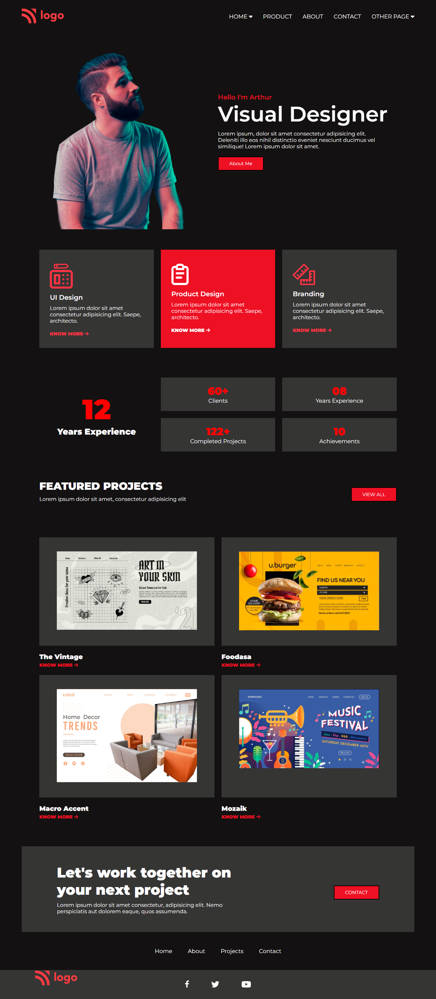

# Project 15

## Product Design Landing Page

### 💻 A Landing Page of a Product Designer. 🖥️

  

#### Built Using HTML & CSS (Desktop view Only 💻)

#### Time Taken to finish the Project - 4.30 hours ⌛ (approx)

---

## Things learned from project -

- 
- 
- 
- 
- 

---

## Live Link [Demo](https://manas-ranjan-murmu-project15.netlify.app/)

### Screenshot

---
